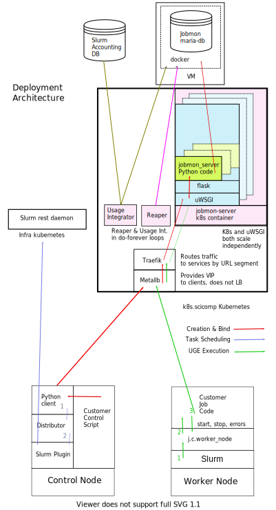
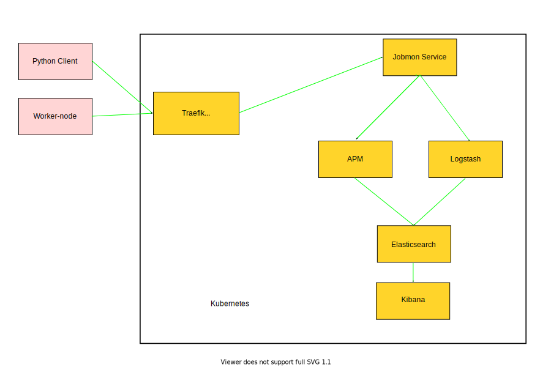
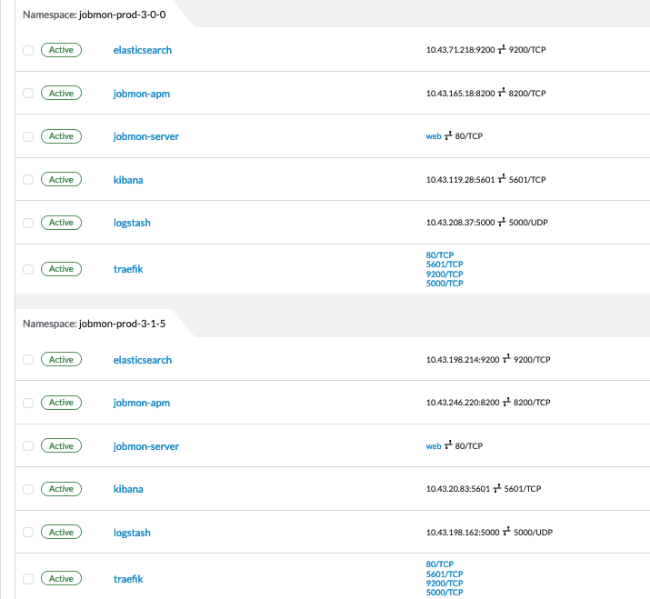
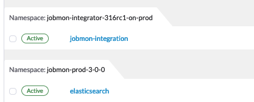

Deployment View
***************

*Which pieces of code are deployed where.*

Jobmon-core is one repository, but its code is deployed in several places around the cluster
and supporting infrastructure.
Sections of Jobmon are deployed in multiple places:

- Python Client, in the same process as the Python control script
- R Client, which calls the Python client in-process using Reticulate
- Worker-node, as a wrapper bash process around the actual Customer Task
- Server, as a Kubernetes service, defined below
- Usage integrator, also a central Kubernetes Service

Only one Python wheel is built. Therefore, the total codebase is actually deployed to each of the above locations,
but only the relevant section is active.

Python Client
=============

The core client logic is written in Python, available to use from the ``jobmon`` Python package.
A Python user
installs Jobmon into their conda/singularity/etc. environment, and
writes a control script defining their workflow. The user
needs both the jobmon core wheel and a plugin wheel.
The latter is an execution interface into the desired cluster on which they wish to run.
If installing via conda or using ``pip install jobmon[ihme]``,
then all IHME-required plugin packages are also automatically installed.
The Jobmon client is conceptually responsible for basic CRUD (Create, Read, Update, Delete).
The actual execution is in the Distributor and DAG Traversal sections, which in the future
will be moved to different deployment units.

At run-time the Python client is just an ordinary package within the
Application's Python process. The Jobmon package communicates via https to the
central Kubernetes service and to the Slurm Rest API.

R Client
========

R users, who may not have experience writing any Python but still wish to use Jobmon,
can use the **jobmonr** library to
write their control scripts
All core logic is still written in Python, but the R client uses the **reticulate** package
to build a simple wrapper around the Python client.
The Python interpreter is dynamically loaded into the same process as the R interpreter.
This allows a user to create and manipulate the necessary Jobmon
objects without needing to write any Python.
The code for the R client does not live in this repository; it is in the SCIC/jobmonr
repository.

Because there is no self-contained execution logic in the R client,
users do need to take a dependency on a Python client.
This is done by setting the ``RETICULATE_PYTHON`` environment variable *prior* to loading the jobmonr library.
This environment
variable should be a file path to the Python executable within a conda environment that has Jobmon installed,
generally ending with something like ``/miniconda3/bin/python``.
If not set by a user, then the R client will default to a centrally
installed conda environment that's managed by the Scicomp team.

**A key limitation of any reticulate package is that you can only have one Python interpreter in memory.**
This means that
if you want to use another reticulate package in the same control script,
you will need to install all dependencies needed for
both packages into a single conda environment.
Additionally, both packages need to be flexible in allowing the user to set
the appropriate interpreter. For example, the widely-used (at IHME) crosswalk package,
produced by MSCA, has a hardcoded, custom-built
conda environment hardcoded in the startup section,
meaning that users *cannot* use both jobmonr and crosswalk in the same memory space.
However, there is very little reason to do so in the first place,
and a small update to the crosswalk package could solve this issue.

The Distributor and Cluster Plugins
-----------------------------------

The Distributor is a separate process launched by the Python Client.
It interacts with the cluster using the Cluster plugin design.
The jobmon-core repository contains three plugins that are useful for testing
and demonstrations:

Sequential
  One job after another using Python process control.

Multiprocessing
  Jobs launched using Python multi-processing.

Dummy
  No jobs are launched, only used to test Jobmon's internal machinery.

The Cluster class and database table represents the Cluster Operating system.
Jobmon has two cluster plugins:

- Slurm
- UGE (aka SGE)

Only the Slurm distributor is in production as of 2022.

Future Directions
=================

In the long term, the scope of the client should be restricted solely to creation of metadata
to send to the database.
DAG traversal and scheduling/distributing would then be performed inside a long-running back-end
service container.
Calls from
the application that are currently synchronous (e.g. execute dag) will become asynchronous.
The executor service could be deployed locally (using Python MP), or deployed centrally as
a highly-scaled kubernetes container.
The main advantages are:

1. The Python client becomes stateless. Once the workflow is started, the client can disappear and
   the workflow will continue to run. It won't matter if the Operator forgot to use tmux or their session
   dies for some reason.
2. The DAG traversal service will now have a publicly-known URL and can be cleanly controlled: stopped, paused etc
3. The R-client-Reticulate linkage can be replaced by a thin R client that just uses S6-class and http
   to communicate with
   other services, thereby improving its reliability and removing the "single reticulate package" constraint.

Worker-node
===========
The worker-node code contains the launching bash script and the python CLI.
The latter runs the actual customer job as a separate process using ``popen.``

Services
========

The server package contains the kubernetes services, plus the model objects for communicating
to the mysql database. The server package is deployed as a Docker container on Kubernetes.
Prior to 1.0.3 Jobmon, services were deployed using docker directly.
The docker-only capability is likely to return
as an optional "Bootable on a Laptop" deployment capability.

There is one main python image on Kubernetes – jobmon-server, but there are also a number of supporting
services:

+-------------------+-----------------------------------------------------------------------+
| Container/Package | Description and Comments                                              |
+===================+=======================================================================+
| elastic-search    | Parses and indexes the raw logs collected by logstash.                |
+-------------------+-----------------------------------------------------------------------+
| jobmon-apm        | The third-party APM monitoring solution                               |
+-------------------+-----------------------------------------------------------------------+
| jobmon-server     | All the Python code to service all requests from the client           |
|                   | and worker-node. Highly scaled.                                       |
+-------------------+-----------------------------------------------------------------------+
| kibana            | GUI layer for APM and elasticsearch.                                  |
+-------------------+-----------------------------------------------------------------------+
| workflow-reaper   | Continually check for lost & dead workflows                           |
+-------------------+-----------------------------------------------------------------------+

In earlier versions Jobmon had multiple types of python images, one for each
major domain object. However, it scaled inefficiently because many "half-pods" were wasted.
It is simpler and more efficient to have all the Python services in one container.

.. The architecture diagrams are SVG, stored in separate files.
.. SVG is renderable in browsers, and can be edited in inkscape or on draw.io

And the flow for monitoring:

Kubernetes
==========

Kubernetes (k8s) provides container orchestration.
The first step in deploying Jobmon is to build a Docker image for the Jobmon server code.
That image is then used to build a series of Docker containers, which are grouped into **pods**.

Since we often need to manage multiple versions of the Jobmon service at one time,
the majority of deployment units are grouped together into a single **namespace**.
The  Rancher screenshot below shows two separate deployments of Jobmon (3.0.0 and 3.1.5)
each running in completely separate namespaces.
Within each namespace is also an Elastic monitoring stack,
responsible for log aggregation and performance monitoring of the Jobmon service.

Inside a namespace, all internal services can reach each other via DNS lookup -
Kubernetes assigns the DNS names automatically.
External traffic, either external to Kubernetes entirely or
from a separate namespace, is all routed through Traefik.
Traefik can then route the incoming requests to the appropriate service.
Namespace networks are separate, so the different deployments of Jobmon
cannot interfere with each other.

The Jobmon reaper introduces some added complexity to the
networking architecture outlined above. The reaper is dependent on the allowed/disallowed
finite state machine transitions, so each version of Jobmon needs its own reaper
in order to ensure that new or modified states are accounted for.
However, server-side updates with no client-facing changes often
are "hot deployed" so that users can take advantage of server upgrades without needing to upgrade their clients.
While this is fine for the service as the Jobmon service is stateless,
the reaper is not - it depends on database state,
so old reapers cannot be spun down and reinstantiated like the service deployment can while
any of their matching clients exit.

The solution is to move the reapers to a separate namespace.
The jobmon-reapers namespace exposes one service per k8s namespace, and
forwards web traffic to that namespace's Traefik controller.
Then each reaper deployment can simply connect to the reaper service,
ensuring that hot deploys and updates can be made to the target namespace
without eliminating existing reaper deployments.

Gunicorn
========

Gunicorn is a Python WSGI HTTP server. It is used to serve the Jobmon server code, and communicates between the
NGINX web server and the Python virtual machine within the jobmon-server container. It also
scales the number of worker-threads, see below.

In our architecture, gunicorn runs inside each of the docker containers created by Kubernetes [#f1]_ .
Gunicorn consists of a main process that manages a series of flask worker processes, and reaps them if the global timeout
is exceeded.

Autoscaling Behavior
====================

Jobmon relies on gunicorn and Kubernetes to autoscale so as to remain performant under
heavy load.
Gunicorn manages threads within one container; Kubernetes manages whole containers.

In the event of a very large workflow, or a series of concurrent workflows,
the jobmon-server pods can become overloaded with incoming requests, leading to timeouts or lost jobs.

Each container starts with 4 worker processes as specified in the gunicorn.conf.py file. As the number of requests increases,
container-level worker processes will increase memory and CPU utilization inside the container to be able to manage the load.

Kubernetes uses `horizontal autoscaling algorithm <https://kubernetes.io/docs/tasks/run-application/horizontal-pod-autoscale/>`_
when it detects heavy memory or CPU load in the containers.
When either CPU or memory is at 80% or more utilization, we can spin up more containers up to a limit of 25.

Metallb
=======

Metallb is the load balancer that comes packaged with Kubernetes.
It is only used to provide the Virtual IP (VIP) to the clients; it does not actually do any
load balancing.

Traefik
=======
Traefik (pronounced *tray-fick*) is an open-source edge router.
Traefik parses the
incoming URL and routes the message to the appropriate back-end service.
It also load-balances across the set of kubernetes instances for a service.
For example, an incoming series of /server/* routes will be routed between each of the initial five jobmon-server pods.
However, the load handled by the Jobmon service is not always equal.
If Kubernetes autoscales as decribed above, then Traefik automatically detects the new containers.
It will then divert some incoming routes to the newly created containers in order
to allow heavily-utilized containers to finish processes off. When the usage spike is over,
and container usage dips below some minimum threshold,
the newly spawned containers will then be killed until the load drops below the scaling threshold.

Full-stack Message-Flow Example
===============================

Take a simple Jobmon request: we want to manually set the state of a workflow run to be state "E",
so the workflow can be retried.

``wfr.update_status("E")``

1. The update_status function constructs a message to the route
   route ``/swarm/workflow_run/<workflow_run_id>/update_status``
#. The ``requester`` Python package within the client sends it to a configured IP address owned by Metallb.
#. Metallb  sends the request to Traefik
#. The Traefik controller routes the request to the next jobmon-server container
#. Nginx within the container (part of the tiangolo base image) passes it to gunicorn
#. Gunicorn, running inside the container, assigns a worker-thread to handle the request.
#. The request arrives at Python-Flask
#. (Finally) Flask calls the actual Jobmon code to handle the request. Generally this code will require one or multiple
    database queries, handled by sqlalchemy.
#. The response data is sent back to the main process.
#. The main process sends the returned data back to the client application.

Kubernetes is asynchronously scaling the number of pods up and down as needed to handle a high volume of incoming requests.

Performance Monitoring
======================

The Kubernetes cluster workload metrics can be tracked
on `Rancher <https://k8s.ihme.washington.edu/c/c-99499/monitoring>`_.
Regarding autoscaling, the important information to track is the per-pod container workload metrics.
The container-specific workloads can be seen by navigating to the
jobmon cluster -> namespace (dev or prod) -> pod (client, swarm, visualization, etc.).

The **Workload Metrics** tab displays a variety of time series plots,
notably CPU Utilization and Memory Utilization, broken down by container.
This allows tracking of what resources are running in each container.
When evaluating performance during heavy load,
it's important to check the utilization metrics to ensure containers are using the right amount of resources.
Low utilization means container resources are not being used efficiently,
and high utilization means the autoscaler is not behaving properly.
The **Events** tab will track notifications of when pods are created
or spun down based on the horizontal autoscaler.
During periods of heavy load, it's important to check that containers are indeed being instantiated correctly,
and no containers are getting killed when there is still work to be allocated.

To ensure that routes are being processed efficiently,
we can also look at the traefik controller Grafana visualizations.
This visualization currently lives at port 3000 of the relevant namespace's IP address.
For example, the traefik visualization for the current Jobmon dev deployment lives at http://10.158.146.73:3000/?orgId=1 [#f2]_ . The traefik dashboard can also be accessed from Rancher, by selecting the "3000/tcp" link under the traefik pod.

This visualization will track the number of requests over time, by return code status.
We can also see the average 99th percentile response time broken down over a configurable time window.
Benchmarks for good performance are:

1. 99th percentile response time is always <1s. Ideally, the average 99th percentile response time does not exceed 500-600 milliseconds.
2. There are very few return statuses of 504.
   504 is the HTTP return code for a connection timeout,
   meaning our request took too long to be serviced.
   There is built-in resiliency to Jobmon routes, meaning that single-route timeouts are not necessarily fatal for the client. However, consistent timeouts is indicative of a performance bottleneck and can result in lost workflows.

If either of the two above conditions are not met,
first check the aforementioned workload metrics and events panels.
In the case that Kubernetes autoscaling isn't detecting busyness appropriately,
we can actually force manual autoscaling by manually adding containers to the overwhelmed pods.
This can be done by incrementing the "config scale" toggle on the pod-specific page.

If container busyness is low but latencies are still high,
check the container logs in the Traefik pod to see individual route latencies and
identify the bottlenecking route call [#f3]_ .

.. rubric:: Footnotes

.. [#f1] Technically, incoming/outgoing communication to the client is managed by nginx, but since it's not relevant to the autoscaling behavior nginx discussion is omitted here.

.. [#f2] The IP address and port number may change over time, depending on the Kubernetes configuration. Check the metallb repository to confirm the correct IP address.

.. [#f3] As of now, almost all slowness in the server can be attributed to throttled database read/write access. Common solutions are to suggest spacing out workflow instantiation, or binding tasks/nodes in smaller chunks.
