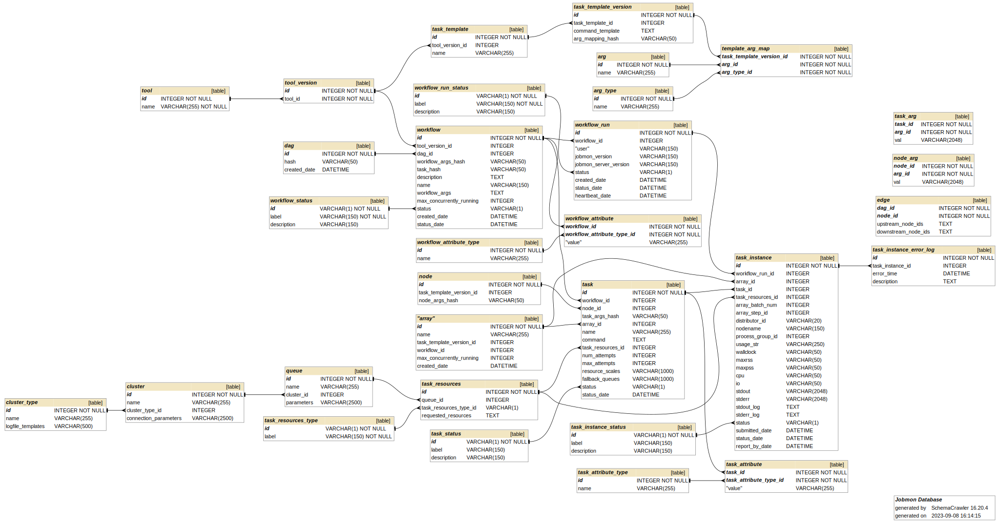

***********
Deployments
***********

More details are available in the :doc:`continuous_integration` section.

Docker
######
The jenkins pipelines a docker image with the Jobmon server Python code.
The images are stored in IHME's Artefactory server.

Kubernetes
##########
Jobmon is deployed on Kubernetes (k8s), for two main reasons.
Firstly, it takes advantage of Kubernetes to perform internal networking,
so that the different deployment units and monitoring elements can communicate
with minimal developer effort.
Secondly, the Kubernetes control plane can flexibly scale up and down container instances as needed
in order to be flexible with load.

Kubernetes deployments can communicate each other by creating internal services that link container ports,
in order to enable data exchange. This is necessary for logging and workflow reaping, for example.

Helm
****

Jobmon's kubernetes deployments are managed by Helm,
a self-described "package manager for Kubernetes".
Rather than deploy individual deployments and services one by one,
we can instead define Helm charts to spin up/down
the major Jobmon components in the correct order.

Helm charts are deployed to a specific namespace, and
can be upgraded or rolled back freely.
Helm maintains up to ten versions of a deployed chart.

However, Helm cannot deploy objects to a namespace besides the target namespace.
This can be problematic for certain resources,
such as Traefik's custom resource definitions and RBACs that are defined in the Rancher global namespace. As a result, global resources still need to be deployed manually.

Additionally, Helm can't truly add or delete resources from a chart definition.
For example, the jobmon reapers helm chart only defines a single reaper that is version-specific. When the reapers chart is upgraded in k8s, the existing reaper deployments are then **orphaned** from Helm, meaning that they are no longer managed by the Helm package manager (deletions, updates, etc. must now be done manually).

Database
########
Jobmon uses one mysql database. All database access is via services running in Kubernetes.
The database server can be deployed anywhere. Ours is deployed in Azure.

Critical Database Config Values
*******************************
Check these manually after a new database is created, or after a database reboot,
or after maintenance.

  +-------------------------+----------------------------+
  + Setting                 +  Value                     +
  +=========================+============================+
  + WAIT_TIMEOUT            +  600                       +
  +-------------------------+----------------------------+
  + THREAD_POOL_SIZE        +  Set automatically on boot +
  +-------------------------+----------------------------+

There are two places that WAIT_TIMEOUT is configured. One is as a global
variable, which can be set by:
``SET GLOBAL wait_timeout=600;``

Using mysqldump to copy a database
**********************************

On the cluster, run a command like the following:
::
mysqldump -h jobmon-prod-1.db.ihme.washington.edu --port 3306 -u docker -p docker --database docker > dbs_dump.sql

Spinning down a database
************************

1. SSH into the database machine
1. Use "docker ps" to find the mariadb container name
1. Use "docker stop <container_id>" to stop the container

Using APM to find Slow Queries
******************************

The APM monitoring system breaks down the time spent when handling a message to
a route into the Python part and the databse part.
APM also shows database transaction times, so it is easy to see the slow queries.
APM has largely made slow query logging obsolete.

Enabling Slow Query Logging
***************************

Slow query logging is a database feature that records the time spent on slow
(long-running) queries, so that engineers can locate the queries that need
optimizing.
This negatively affects performance, so only do it in produciton if there really is a problem.
It should be enabled for at least some of the time during load tests prior to a release.
You need to be logged in to mysql as the root user.

.. code-block:: sql

  SET GLOBAL slow_query_log = 'ON';
  SET GLOBAL long_query_time = 2; # in seconds, default is 10
  SET GLOBAL slow_query_log_file = '/path/filename'; # Default /var/log/mysql/mariadb-slow.log

Very Important: You have to log out and in for it to have an effect. You can check by:

.. code-block:: sql

  SHOW VARIABLES;

Turn it off when you are done:

.. code-block:: sql

  SET GLOBAL slow_query_log = 'OFF';

Historical Port and Host Versions
*********************************

Can be found on the hub at https://hub.ihme.washington.edu/display/DataScience/Jobmon+Database+Connections
For pre 3.0 see
https://hub.ihme.washington.edu/display/DataScience/Jobmon+Version+Record

Further Configuration
*********************
Set machine specific configuration in the /deployment/docker-compose/jobmon.ini file

- WEB_SERVICE_PORT: external port to connect to flask services on (default connection is localhost:3000)
- EXTERNAL_DB_PORT: external db port to connect to db on (default is localhost:3306 user: read-only pass: docker)
- LOCAL_PATH: Filepath to mount on the container, default is your root directory: ~/.

How to Run a Workflow Locally
*****************************
The only special configuration for running locally is that you must set the
`executor_class` as either `SequentialExecutor` or `MultiprocessingExecutor` in your Workflow
Object and Task Objects.

You may also want to run your local workflow against a local web server and database, rather than against a centrally
deployed and managed web server. To instantiate a local web server, you should first install the jobmon[server]
dependencies using `pip install jobmon[server]`, as well as ensure sqlite is installed on your machine.

Then, you can use the following script to create and run a web server. This script will create a Flask server on your
machine's localhost and run it in development mode, as well as create a SQlite database and initialize it with the
expected schema. Note that this web server will not handle high-volume concurrency well, but that's unlikely to be a
bottleneck for small local workflows.

.. code-block:: python

    import os

    import socket
    import sys

    from jobmon.server.web.api import get_app, JobmonConfig
    from jobmon.server.web.db_admin import init_db
    from sqlalchemy import create_engine

    # Setup local Jobmon web service
    class WebServerProcess:
        """Context manager creates the Jobmon web server in a process and tears it down on exit."""

        def __init__(self, filepath: str) -> None:
            """Initializes the web server process.
            Runs on
            Args:
                filepath: path to the SQLlite database file backing up the service.
            """
            if sys.platform == "darwin":
                self.web_host = "127.0.0.1"
            else:
                self.web_host = socket.getfqdn()
            self.web_port = 10_000 + os.getpid() % 30_000
            self.filepath = filepath

        def start_web_service(self):
            """Starts the web service process."""
            database_uri = f"sqlite:///{self.filepath}"
            if not os.path.exists(self.filepath):
                open(self.filepath, 'a').close()  # Make an empty database file
                init_db(database_uri)

            config = JobmonConfig(
                dict_config={"db": {"sqlalchemy_database_uri": database_uri}}
            )
            app = get_app(config)
            config.set(
                "http",
                "service_url",
                f"http://{self.web_host}:{self.web_port}",
            )
            config.write()

            # Run the app
            with app.app_context():
                app.run(host="0.0.0.0", port=self.web_port)

    def start_web_service(filepath='/path/to/sqlite/file.db'):
        server = WebServerProcess(filepath=filepath)
        server.start_web_service()

This script will also configure your client automatically so the next workflow you run will point to the local web
server. Note that running the web server is a blocking process, so you might need to background the process.

See the Quickstart docs to get started creating a workflow with tasks to run.

To Access the Local Database
****************************
In a standard sql database management application such as SequelPro or MySQL Workbench, connect to your database at::

    host: 0.0.0.0
    username: read_only
    password: docker
    port: 3306

The jobmon tables will be in the docker database
